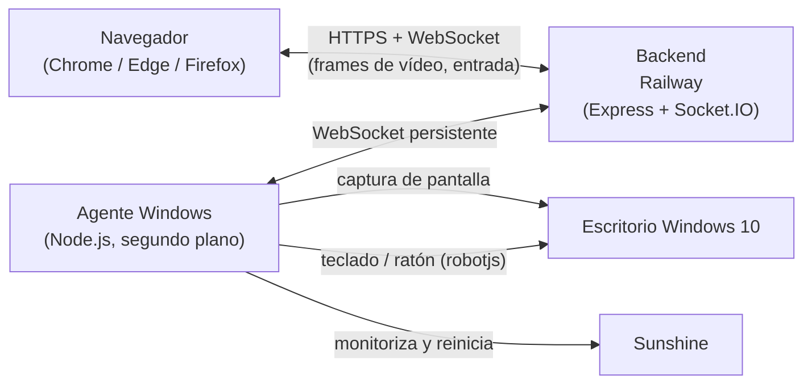

# Cloud Gaming — Escritorio Remoto para Gaming

Plataforma de escritorio remoto que permite controlar completamente un PC con Windows 10 desde un navegador web (Chrome, Edge o Firefox), sin instalar nada en el dispositivo cliente.

Abres una URL pública, pulsas **Conectar** y usas tu PC como si estuvieras sentado frente a él: vídeo del escritorio, teclado, ratón, y cualquier aplicación instalada (Roblox, Minecraft, Steam, Discord, navegadores, explorador de archivos…).

Sin login, sin registro, sin usuarios, sin base de datos. Una única sesión remota simultánea.

---

## Arquitectura



| Componente  | Tecnología                | Función                                                                 |
| ----------- | ------------------------- | ----------------------------------------------------------------------- |
| `frontend/` | React + Vite + TypeScript | Página única: estado del host, botón Conectar, streaming, pantalla completa |
| `backend/`  | Node.js + Express + Socket.IO | Señalización, gestión de sesión única, relay de frames y entrada, estado del host |
| `agent/`    | Node.js + TypeScript      | Se ejecuta en el PC Windows: captura pantalla, aplica teclado/ratón, vigila Sunshine |

**Nota sobre Sunshine:** Sunshine no expone una interfaz web utilizable directamente por el navegador. El agente lo monitoriza y lo reinicia automáticamente, y el canal de señalización WebRTC (`signal`) está implementado de extremo a extremo (backend como relay) para transporte nativo de baja latencia. El streaming funcional por defecto usa frames capturados por el agente y retransmitidos por WebSocket, lo que garantiza vídeo, teclado y ratón completos desde el navegador sin plugins.

---

## Requisitos

**Host (tu PC Windows 10 Pro):**
- Windows 10 Pro 64 bits
- Node.js 18 o superior
- Sunshine instalado (`C:\Program Files\Sunshine\sunshine.exe`)
- Para compilar `robotjs` (control de teclado/ratón): Visual Studio Build Tools
  - `npm install --global windows-build-tools` **o** instala "Desktop development with C++" desde el instalador de Visual Studio
  - Si `robotjs` no compila, el resto funciona, pero no habrá control de entrada hasta resolverlo

**Cliente:** cualquier dispositivo con Chrome, Edge o Firefox actualizado. Nada que instalar.

**Despliegue:** Railway CLI instalado y autenticado (`railway login`).

---

## Instalación local

```powershell
# 1. Backend
cd backend
npm install
copy .env.example .env     # edita AGENT_TOKEN
npm run build
npm run dev                # desarrollo en http://localhost:4000

# 2. Frontend (otra terminal)
cd frontend
npm install
copy .env.example .env     # VITE_BACKEND_URL=http://localhost:4000
npm run dev                # http://localhost:5173

# 3. Agente (otra terminal, en el host Windows)
cd agent
npm install
copy .env.example .env     # BACKEND_URL y AGENT_TOKEN (mismo token que el backend)
npm run build
npm start
```

Abre `http://localhost:5173` y pulsa **Conectar**.

---

## Configuración de Sunshine

1. Instala Sunshine desde su sitio oficial e inícialo una vez para generar su configuración.
2. Verifica que el ejecutable existe en `C:\Program Files\Sunshine\sunshine.exe`. Si está en otra ruta, ajusta `SUNSHINE_PATH` en `agent\.env`.
3. El agente verifica cada 15 s (`SUNSHINE_CHECK_INTERVAL_MS`) que `sunshine.exe` esté en ejecución y **lo reinicia automáticamente** si se detiene.
4. El estado de Sunshine se muestra en la interfaz web (badge "Sunshine: activo/detenido").

---

## Instalación del agente (inicio automático con Windows)

Como **Administrador**:

```powershell
cd "c:\ruta\al\proyecto"
powershell -ExecutionPolicy Bypass -File scripts\install-agent.ps1
```

El script:
- Crea la tarea programada `CloudGamingAgent` que arranca **al iniciar Windows** (cuenta SYSTEM, sin necesidad de login, en segundo plano).
- Configura **reinicio automático cada minuto si falla** (hasta 999 reintentos).
- Arranca el agente inmediatamente.

El agente se conecta al backend con reconexión automática infinita ante caídas de red o del servidor.

Desinstalar:
```powershell
powershell -ExecutionPolicy Bypass -File scripts\uninstall-agent.ps1
```

---

## Configuración de Windows 10 (nunca apagar)

Como **Administrador**:

```powershell
powershell -ExecutionPolicy Bypass -File scripts\setup-windows.ps1
```

Aplica: nunca suspender, nunca hibernar (hibernación deshabilitada), nunca apagar discos, nunca apagar adaptadores de red (ahorro de energía desactivado), plan de Alto rendimiento, red persistente.

---

## Modo tapa cerrada (portátiles)

Como **Administrador**:

```powershell
powershell -ExecutionPolicy Bypass -File scripts\lid-closed.ps1
```

Aplica: al cerrar la tapa = **No hacer nada**, botón de encendido = No hacer nada, red siempre activa, Modern Standby deshabilitado. Sunshine, el agente y el escritorio remoto siguen disponibles con la tapa cerrada.

---

## Despliegue en Railway

Railway CLI ya está autenticado. Un solo comando lo hace todo:

```powershell
powershell -ExecutionPolicy Bypass -File scripts\deploy-railway.ps1 -AgentToken "un-token-largo-y-seguro"
```

El script automatiza los 8 pasos:

1. Crea el proyecto Railway `cloud-gaming`
2. Crea el servicio `backend`
3. Crea el servicio `frontend`
4. Linkea `backend/` al servicio backend
5. Linkea `frontend/` al servicio frontend
6. Despliega el backend con `railway up` (variables: `AGENT_TOKEN`, `CORS_ORIGIN`)
7. Despliega el frontend con `railway up` (variable: `VITE_BACKEND_URL` con la URL del backend)
8. Genera los dominios públicos y **muestra la URL final**

Al terminar verás:

```
======================================================
  URL PÚBLICA:  https://frontend-xxxx.up.railway.app
  Backend:      https://backend-xxxx.up.railway.app
======================================================
```

**Último paso:** configura el agente en tu PC con esos valores:

```ini
# agent\.env
BACKEND_URL=https://backend-xxxx.up.railway.app
AGENT_TOKEN=un-token-largo-y-seguro
```

Y reinicia el agente: `powershell -File scripts\maintenance.ps1 -Action restart-agent`

Abre la URL pública en Chrome/Edge/Firefox y pulsa **Conectar**.

### Variables de entorno

| Servicio | Variable        | Descripción                                  |
| -------- | --------------- | -------------------------------------------- |
| backend  | `AGENT_TOKEN`   | Token que autentica al agente Windows        |
| backend  | `CORS_ORIGIN`   | Origen permitido (`*` o URL del frontend)    |
| backend  | `PORT`          | Puerto (Railway lo asigna automáticamente)   |
| frontend | `VITE_BACKEND_URL` | URL pública del backend (se embebe en build) |
| agent    | `BACKEND_URL`   | URL pública del backend                      |
| agent    | `AGENT_TOKEN`   | Mismo token del backend                      |
| agent    | `SUNSHINE_PATH` | Ruta de `sunshine.exe`                       |
| agent    | `STREAM_FPS`    | Fotogramas por segundo (1–30, defecto 8)     |

---

## Uso

- **Conectar**: botón principal. Si el host está offline o hay otra sesión activa, se muestra el motivo.
- **Ratón**: mueve y haz clic directamente sobre el área de vídeo (clic izquierdo/derecho/central, rueda).
- **Teclado**: se captura todo el teclado mientras la sesión está activa, incluidas teclas especiales (F1–F12, flechas, Win, etc.).
- **Pantalla completa**: botón en la barra de herramientas.
- **Reconexión automática**: si se cae la red o el backend se reinicia, la sesión se reestablece sola.
- **Desconectar**: libera la sesión para otro acceso.

---

## Solución de problemas

| Problema | Solución |
| -------- | -------- |
| "Host offline" | Verifica que el PC esté encendido, con red, y la tarea `CloudGamingAgent` en ejecución: `scripts\maintenance.ps1 -Action status` |
| "Ya hay una sesión activa" | Solo se permite una sesión. Cierra la otra pestaña/dispositivo o espera a que expire. |
| Pantalla negra / sin vídeo | El host puede estar en pantalla de bloqueo o sin sesión gráfica. Inicia sesión en el PC una vez tras el arranque (o configura autologon). |
| El ratón/teclado no responde | `robotjs` no compiló. Instala VS Build Tools y reinstala: `cd agent; npm rebuild robotjs` |
| Sunshine detenido | El agente lo reinicia solo en ≤15 s. Si persiste: `scripts\maintenance.ps1 -Action restart-sunshine` |
| Vídeo lento | Baja `STREAM_FPS` en `agent\.env` o mejora la subida del host. |
| Error de token | `AGENT_TOKEN` debe ser idéntico en backend (Railway) y `agent\.env`. |
| railway up falla | Ejecuta `railway status` en la carpeta del servicio para verificar el enlace, y `railway logs` para ver el error. |

---

## Comandos de mantenimiento

```powershell
# Estado completo (agente, Sunshine, Node, red)
powershell -File scripts\maintenance.ps1 -Action status

# Reiniciar el agente
powershell -File scripts\maintenance.ps1 -Action restart-agent

# Reiniciar Sunshine
powershell -File scripts\maintenance.ps1 -Action restart-sunshine

# Comprobación rápida
powershell -File scripts\maintenance.ps1 -Action health

# Logs de Railway
cd backend  ; railway logs
cd frontend ; railway logs
```

---

## Docker local (opcional)

```powershell
# Backend
docker build -t cloud-gaming-backend ./backend
docker run -p 4000:4000 -e AGENT_TOKEN=tu-token cloud-gaming-backend

# Frontend
docker build -t cloud-gaming-frontend --build-arg VITE_BACKEND_URL=http://localhost:4000 ./frontend
docker run -p 8080:80 cloud-gaming-frontend
```

---

## Estructura del proyecto

```
Cloud Gaming/
├── frontend/            # React + Vite + TypeScript
│   ├── src/
│   │   ├── App.tsx
│   │   ├── components/StreamViewer.tsx
│   │   ├── socket.ts
│   │   └── types.ts
│   ├── Dockerfile
│   ├── nginx.conf
│   └── railway.json
├── backend/             # Express + Socket.IO
│   ├── src/
│   │   ├── index.ts
│   │   ├── socketHandlers.ts
│   │   ├── sessionManager.ts
│   │   ├── config.ts
│   │   ├── logger.ts
│   │   └── types.ts
│   ├── Dockerfile
│   └── railway.json
├── agent/               # Agente Windows
│   ├── src/
│   │   ├── index.ts
│   │   ├── streamer.ts
│   │   ├── inputController.ts
│   │   ├── sunshineMonitor.ts
│   │   ├── config.ts
│   │   ├── logger.ts
│   │   └── types.ts
│   └── .env.example
├── scripts/             # PowerShell: energía, tapa cerrada, agente, Railway
│   ├── setup-windows.ps1
│   ├── lid-closed.ps1
│   ├── install-agent.ps1
│   ├── uninstall-agent.ps1
│   ├── maintenance.ps1
│   ├── deploy-railway.ps1
│   └── deploy-railway.sh
├── railway.json
└── README.md
```
